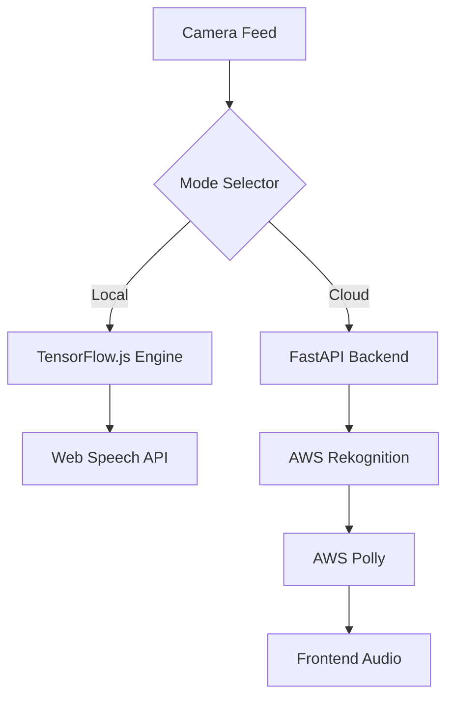

# Vision Assist

[](https://realtime-vision-assit.netlify.app/)


Real-time object detection and narration for visual accessibility. Vision Assist combines browser-based detection with optional cloud analysis so users can receive spoken feedback about their surroundings.

## Live Demo

[https://realtime-vision-assit.netlify.app/](https://realtime-vision-assit.netlify.app/)

## What It Does

- Detects objects from a live camera feed
- Narrates detected objects through speech feedback
- Supports local browser-based analysis for privacy and low latency
- Supports optional backend analysis for higher-quality cloud recognition
- Uses a responsive interface designed for mobile and desktop screens

## Technical Overview

| Mode | Purpose | Technologies |
| --- | --- | --- |
| Local mode | Fast, private, zero-cost object detection in the browser | TensorFlow.js, COCO-SSD, Web Speech API |
| Cloud mode | Higher-resolution label detection and generated voice output | FastAPI, AWS Rekognition, AWS Polly |

## Architecture



## Getting Started

### Frontend

```bash
npm install
npm run dev
```

### Backend for AWS Mode

```bash
cd backend
python -m venv .venv
.\.venv\Scripts\activate
pip install -r requirements.txt
uvicorn main:app --reload --host 127.0.0.1 --port 8000
```

Create `backend/.env` with:

```env
AWS_REGION=us-east-1
AWS_ACCESS_KEY_ID=your_access_key
AWS_SECRET_ACCESS_KEY=your_secret_key
POLLY_VOICE_ID=Joanna
```

## Deployment

The frontend can be deployed to Netlify or Vercel. Backend deployment requires a Python environment with access to the configured AWS services.

```bash
docker compose up --build
```

## Development Stack

- Interface: React, Tailwind CSS, Lucide Icons, shadcn/ui
- Backend: FastAPI, Boto3, OpenCV
- AI and speech: TensorFlow.js, AWS Rekognition, AWS Polly, Web Speech API

## License

Add a license file before reusing or distributing this project publicly.
